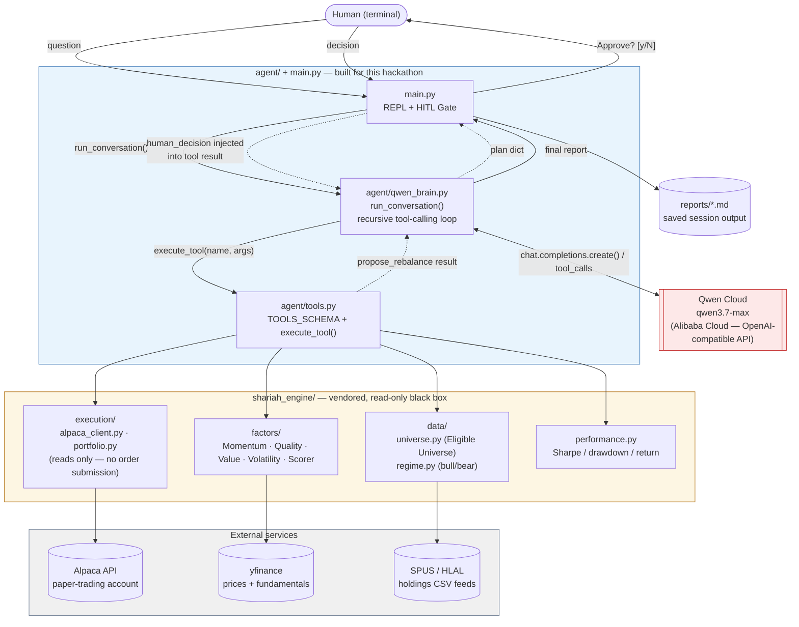

# Architecture

This is a terminal-based agent — there is no database or web frontend. The diagram below shows every component in the actual request path: how Qwen Cloud connects to the orchestration layer, the read-only Shariah Engine, and the external data sources (Alpaca, yfinance, ETF holdings feeds).

## Key boundaries

- **The agent never calls `OrderExecutor`.** `shariah_engine/execution/` only contains read functions (`alpaca_client.get`, `portfolio.get_current_portfolio`). The order-submission module from the original engine was deliberately never vendored — see [`docs/adr/0001-read-only-advisor-boundary.md`](docs/adr/0001-read-only-advisor-boundary.md).
- **The HITL Gate lives in `main.py`, not inside the model.** Qwen never decides whether a Rebalance Plan is approved — the terminal blocks on real human input, and the decision is injected into the tool result before Qwen's next turn.
- **Qwen Cloud is the only Alibaba Cloud service in the request path** — `agent/qwen_brain.py` calls `https://dashscope-intl.aliyuncs.com/compatible-mode/v1` (Qwen Cloud's OpenAI-compatible endpoint) for every reasoning/tool-calling step.
